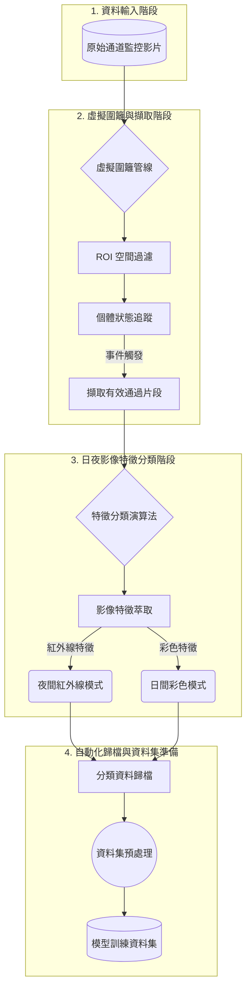

## 資料集基本資訊

**資料集名稱**：多模態多視角乳牛通道影像資料集 (COW_Passageway)  
**建立日期**：2026-06-23  
**資料負責人**：李育旻  
**專案歸屬**：[115 年 xxx - xxx]

## 資料概述

1. **虛擬圍籬與自動擷取 (Virtual Fence)**
   - 整合  YOLO11 與 ByteTrack 進行多目標追蹤。
   - 使用 **IoA (Intersection over Area)** 比例判斷牛隻是否進入感應區，解決邊緣震盪問題。
   - 內建過濾機制：濾除長寬比異常、靜止不動或停留時間過短的無效片段。
   - 長時間停留自動分割（預設停留超過 20 秒自動切分新片段）。

### 研究目的

該資料集用於開發**非接觸式乳牛影像辨識與自動化通道監控資料管線**，專門針對乳牛通道監控影像進行精準擷取與自動分類。透過 YOLO 偵測與多目標追蹤演算法，結合虛擬圍籬技術，系統能夠有效解決傳統人工影片篩選中存在的高勞動力依賴、主觀判斷偏差等問題，並根據影像特徵（色彩與飽和度指標）將片段自動歸檔。本資料集為乳牛體況評估、自動影像辨識與智慧乳牛管理提供高品質、標準化的多模態資料來源，支援畜牧管理人員進行科學化的乳牛健康與行為監測。

### 資料特徵資訊

- **資料類型**：通道監控影像資料（可見光、紅外線、深度資訊）
- **蒐集期間**：2024-06-12 至 迄今 
- **蒐集頻率**：配合牧場作業而定
- **資料格式**：`.mp4`（擷取之有效通道影片片段）、`.mat`（原始多模態資料）
- **資料大小**：[待確認]

## 資料蒐集方法

- **實驗類型**：控制與現地觀測實驗
- **實驗環境**：國立中興大學畜產試驗場(溪心壩)
- **控制變數**：引導牛隻通過設有相機之通道區域
- **觀測目標**：Holstein 乳牛

### 蒐集設備與工具

| 設備與工具 | 型號與版本 | 用途 | 規格與指南 |
|----------|------|------|------------|
| Synology | BC500 | 獲取通道多模態影像 | [規格](https://www.synology.com/zh-tw/company/news/article/camera_combo) |

## 資料結構說明

### 整體系統架構圖



### 檔案組織架構

```
COW_Passageway/
├── COW_dataset/                # 自動化管線分類與歸檔之資料集
│   ├── COLOR_STABLE/           # 日間彩色模式影像片段 (.mp4)
│   ├── IR_MODE/                # 夜間紅外線模式影像片段 (.mp4)
│   └── calibration/            # 相機校正檔案
├── morning_event/              # 牧場現場擷取之原始通道影片
└── configs/                    # 偵測與追蹤模型設定檔
```

### 資料夾與檔案說明
- `COW_dataset/COLOR_STABLE`：存放經自動分類演算法判定為「日間彩色」的乳牛通道通過片段。
- `COW_dataset/IR_MODE`：存放經自動分類演算法判定為「夜間紅外線」的乳牛通道通過片段。
- `COW_dataset/calibration`：存放多視角相機校正參數。
- `morning_event`：存放牧場收案現場所獲取的原始通道監控影片，為自動化虛擬圍籬管線之輸入來源。

### 文檔導航
| 描述 | 閱讀指南 |
|------|------|
| 說明系統自動化管線與分類演算法指南 | [閱讀指南](docs/ALGORITHM.md) |
| 說明系統功能、參數設定與指令操作指南 | [閱讀指南](docs/OPERATING_MANUAL.md) |

### 資料請求

**電子郵件提交**
```text
收件人：7114040001@smail.nchu.edu.tw
主旨：[多模態多視角乳牛通道影像資料集]使用申請 - [您的姓名] - [機構名稱]  
內容：說明申請目的與預期研究用途  
```

## 聯絡資訊與更新記錄

### 聯絡資訊

**主要負責人**：李育旻  
**身份**：碩士生  
**電子信箱**：7114040001@smail.nchu.edu.tw  
**實驗室**：國立中興大學 生物產業機電大樓 6F K604 研究室

### 版本更新記錄

| 版本 | 日期 | 更新內容 | 更新人員 |
|------|------|---------|---------|
| v1.0.0 | 2026-06-23 | 建立通道多模態資料集分類與歸檔結構 | 李育旻 |

---

## 引用格式

如果您在研究中使用了本專案的資料或程式碼，請按以下格式引用：

```bibtex
@dataset{nchu_cattle_dataset_2026,
  title={Multi-modal and multi-view dairy cow passageway image dataset},
  author={Yu-Min Li and ISSP & MES LAB},
  year={2026},
  institution={Department of Bio-industrial Mechatronics Engineering, National Chung-Hsing University, Taichung, 402202, Taiwan},
  url={https://github.com/issp-mes-lab/multi-view-dairy-cow.git}
}
```

---
© [ISSP & MES LAB](https://www.issp-mes.org)
