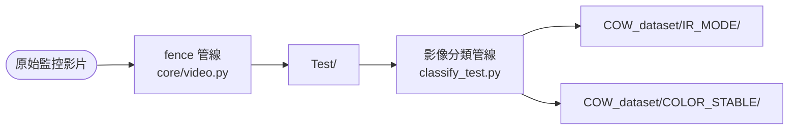
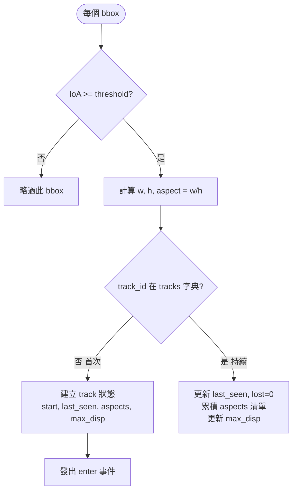
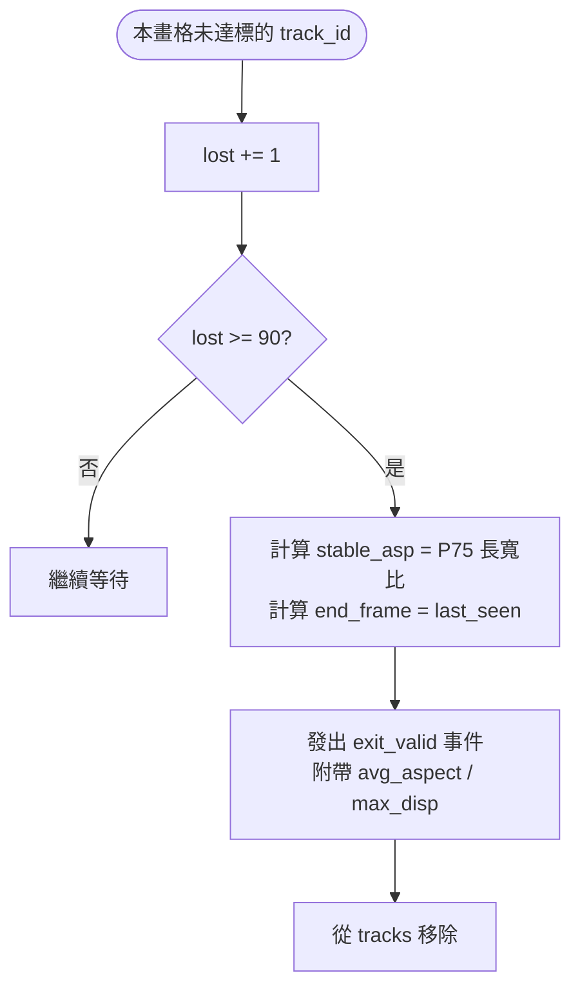
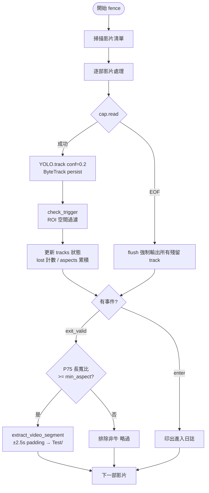
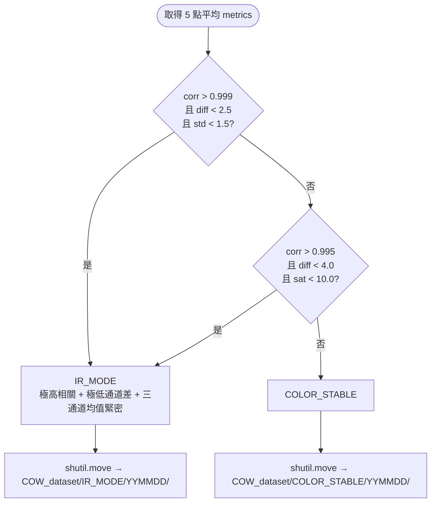
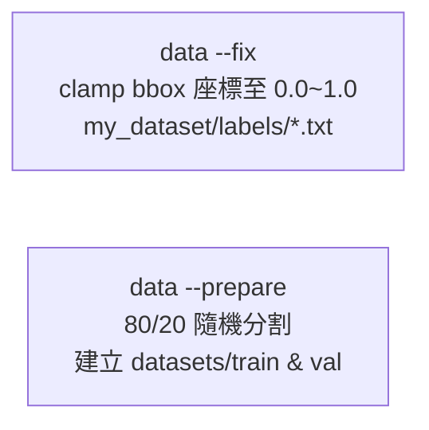

# 系統演算法流程文件 (Algorithm Flow)

> 本文件依據程式碼現況（2026-05-13）撰寫，詳述三條核心管線的所有判斷機制。

---

## 1. 整體系統管線概覽



**三條管線的觸發方式：**

| 指令 | 對應管線 |
|---|---|
| `python main.py fence ...` | 虛擬圍籬擷取 |
| `python main.py data --classify` | 影像特徵分類 |
| `python main.py data --fix / --prepare` | 資料集預處理 |

---

## 2. 虛擬圍籬管線 (fence)

### 2-1. 推論層：CowDetector.track()

**每畫格呼叫一次**，傳回帶有 ByteTrack `track_id` 的偵測結果。

| 參數 | 值 | 說明 |
|---|---|---|
| `persist=True` | 固定 | ByteTrack 跨畫格維持 ID 連續性 |
| `conf` | CLI `--conf`，預設 0.2 | 信心門檻；低於此值的 bbox 在 YOLO 層捨棄 |
| `classes` | `[class_id]`，預設 0 | 強制只偵測指定類別（19=cow for COCO） |
| `imgsz` | 1280 | 推論解析度；影響小目標偵測率 |
| `agnostic_nms` | True | 跨類別 NMS，避免同位置重複框 |
| `tracker` | `custom_tracker.yaml` | ⚠ **此檔案須存在於工作目錄**，否則崩潰 |

> **注意**：`custom_tracker.yaml` 目前仍為硬編碼路徑，若不存在請改回 `"bytetrack.yaml"`（ultralytics 內建）。

---

### 2-2. ROI 空間過濾 (IoA 比例)

**每個 bbox 的空間判定**，在 `check_trigger()` 中執行。不再使用單一中心點，改用 **IoA (Intersection over Area)** 比例判斷物體是否進入區域：

```
IoA = (bbox 與 ROI 的交集面積) / (bbox 自身面積)

通過條件：IoA >= ioa_threshold (預設 0.5)
```

當 IoA 達標時，才視為進入（或存在於）ROI 內。這種方式比中心點判定更穩定，能有效過濾邊緣抖動。



---

### 2-3. 個體追蹤狀態機（per-track）

每個 `track_id` 維護以下狀態欄位：

| 欄位 | 說明 |
|---|---|
| `start` | 首次進入 ROI (IoA達標) 的畫格編號 |
| `last_seen` | 最後一次在 ROI 內偵測到的畫格編號 |
| `lost` | 連續未在 ROI 內偵測到（或 IoA 未達標）的畫格數 |
| `aspects` | 所有畫格的 w/h 長寬比清單 |
| `max_disp` | 在 ROI 內相對於進入點的最大位移（像素）|

**消失與超時判定**（`patience_frames = 90`，約 3 秒 @ 30fps）：



---

### 2-4. 長寬比穩定性計算：_get_stable_aspect()

**目的**：排除模型抖動或轉身瞬間產生的極端比值，取得代表整段停留期間的穩定長寬比。

```python
stable_asp = np.percentile(aspects, 75)  # P75
```

- 邏輯：乳牛在多數時間呈橫向（w > h），P75 保留大多數畫格的比值，同時排除極少數轉身造成的異常低值。
- 此值附加在 `exit_valid` 事件的 `avg_aspect` 欄位，供 `main.py` 的事件過濾器使用。

---

### 2-5. 長寬比後處理過濾（main.py 事件層）

**這是目前系統唯一的事件層過濾器**：

```python
if asp < args.min_aspect:   # 預設 min_aspect = 2.0
    print(f"  [排除非牛] ID:{...} 穩定長寬比={asp:.2f} < {args.min_aspect}")
    continue
```

| 參數 | 預設值 | 說明 |
|---|---|---|
| `--min_aspect` | `2.0` | P75 長寬比門檻；低於此值代表 bbox 非橫向，視為非典型偵測（人/局部誤偵）|

通過後，擷取影片段：

```
pad = 2.5 秒 × fps
start_frame = last_seen_start - pad
end_frame   = last_seen_end   + pad
輸出至 Test/{date}_v{n}.mp4
```

> **注意**：目前沒有時間長度下限過濾（已被使用者移除）。任何長寬比達標的事件都會儲存，即使僅 1 秒。

---

### 2-6. 影片結束強制輸出：flush()

影片讀到 EOF（`ret=False`）時觸發，將所有仍在 `tracks` 字典中的個體強制輸出為 `exit_valid`，`end_frame` 設為 `last_seen`（而非 `frame_idx`）。

---

### 完整 fence 管線流程圖



---

## 3. 影像特徵分類管線 (classify_test.py)

### 3-1. 取樣策略

每部影片均勻取 **5 個畫格**（位於 10%～90% 時間位置），避免首尾幀光線異常。

### 3-2. 特徵提取（每個取樣畫格計算 5 個指標）

| 指標 | 計算方式 | IR 預期值 | Color 預期值 |
|---|---|---|---|
| `corr` | `(corrcoef(R,G) + corrcoef(G,B)) / 2` | 趨近 1.0（三通道高度同步）| < 0.99 |
| `diff` | `mean(|R-G|, |G-B|)` 像素層 MAE | < 2.5 | > 5 |
| `std` | `std([mean(R), mean(G), mean(B)])` | < 1.5（三通道平均值幾乎相等）| > 5 |
| `sat` | HSV 飽和度全圖平均 | < 10 | > 15（彩色場景）|
| `bright` | HSV 亮度全圖平均 | 任意 | 任意 |

最終指標 = 5 個取樣點各指標的**算術平均**。

### 3-3. 分類判定邏輯



**兩條 IR 判定路徑的設計意圖**：

| 路徑 | 觸發條件 | 對應場景 |
|---|---|---|
| 嚴格路徑 | corr > 0.999, diff < 2.5, std < 1.5 | 純 IR、無強光，三通道幾乎完全相同 |
| 寬鬆路徑 | corr > 0.995, diff < 4.0, sat < 10.0 | IR 伴隨輕微補光，稍有通道差但飽和度極低 |

> `std < 1.5` 是新加入的第三特徵。R/G/B 各自全圖均值的標準差，在 IR 中三個數字幾乎相等（std ≈ 0），彩色影像即使過曝也因場景偏色而有更大標準差。

---

## 4. 資料集預處理管線



---

## 5. 現況參數速查表

### 虛擬圍籬 (fence)

| 參數 | 硬編碼 / CLI | 當前值 | 可調整位置 |
|---|---|---|---|
| ROI | 硬編碼 | `[20, 100, 2800, 1500]` | `main.py` line 67 |
| `patience_frames` | 硬編碼 | `90`（≈3s @ 30fps）| `main.py` line 69 |
| `--conf` | CLI | `0.2` | 執行時傳入 |
| `--min_aspect` | CLI | `2.0` | 執行時傳入 |
| `--ioa` | CLI | `0.5` | 執行時傳入 |
| `--skip` | CLI | `1`（不跳格）| 執行時傳入 |
| padding | 硬編碼 | `3.0s` | `main.py` line 64 |
| tracker | 硬編碼 | `custom_tracker.yaml` | `core/video.py` line 20 |

### 分類器 (classify)

| 特徵 | IR 嚴格路徑 | IR 寬鬆路徑 |
|---|---|---|
| `corr` | > 0.999 | > 0.995 |
| `diff` | < 2.5 | < 4.0 |
| `std` | < 1.5 | — |
| `sat` | — | < 10.0 |
