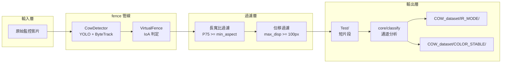

# 環境配置與系統需求說明

> 完整演算法流程圖（Mermaid）請參閱 [ALGORITHM.md](ALGORITHM.md)。

## 1. 依賴套件 (Dependencies)

```bash
pip install ultralytics opencv-python numpy
```

| 套件 | 版本需求 | 用途 |
|---|---|---|
| `ultralytics` | >= 8.0 | YOLO 模型推論與 ByteTrack 多目標追蹤 |
| `opencv-python` | >= 4.8 | 影片讀寫、畫格擷取、HSV 色彩轉換 |
| `numpy` | >= 1.24 | 通道相關性計算（np.corrcoef）與統計特徵 |

---

## 2. 核心模組說明

### `core/video.py`

| 類別 / 函式 | 說明 |
|---|---|
| `CowDetector` | 封裝 `YOLO.track(persist=True)`，取得 ByteTrack 唯一 `track_id` |
| `VirtualFence` | 雙向虛擬圍籬狀態機，以 **IoA (Intersection over Area)** 比例判斷進入，並維護個體位移與計數 |
| `VirtualFence.check_trigger()` | 每畫格呼叫，回傳 `enter / exit_valid / segment_split` 事件 |
| `VirtualFence.flush()` | 影片結束時強制輸出所有仍在 ROI 內的個體 |
| `extract_video_segment()` | 依 start_frame / end_frame 切割並輸出 MP4 片段 |

### `core/classify.py`

| 函式 | 說明 |
|---|---|
| `analyze_video_robust()` | 取 5 個均勻取樣點，計算三通道相關性（`corr`）、通道差（`diff`）、飽和度（`sat`）與亮度（`bright`） |
| `classify_videos()` | 依三層條件判斷 IR / COLOR，呼叫 `shutil.move` 搬移至 `COW_dataset/` |

### `data_utils/`

| 模組 | 說明 |
|---|---|
| `validator.py` | 對 `my_dataset/labels/*.txt` 執行 Bounding Box 座標 clamp（0.0～1.0） |
| `formatter.py` | 隨機 80/20 分割並建立 YOLO 標準目錄結構（`datasets/train/` `datasets/val/`） |

---

## 3. 系統架構圖



---

## 4. 已知行為與注意事項

- **首次執行**：`ultralytics` 的 ByteTrack 依賴 `lap` 套件，首次執行若未安裝會自動下載並顯示 WARNING，直接重新執行即可。
- **GPU 冷啟動**：PyTorch 在同機器首次執行需 5–15 秒 kernel cache 編譯，屬正常現象。
- **`MAX_SEGMENT_SEC = 20.0`**：強制分段已啟用，乳牛在 ROI 內停留超過 20 秒會自動切分影片。
- **`MIN_DISPLACEMENT_PX = 100.0`**：靜止過濾已啟用，牛在 ROI 內位移不足 100 像素將不予儲存。
- **`ioa_threshold = 0.5`**：預設需 50% 面積進入才觸發記錄。
